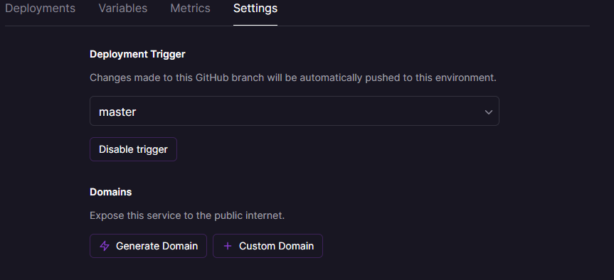

After creating the Line account and obtaining the channel access token, Check out the  [Line API Reference](https://developers.line.biz/en/reference/messaging-api/#bot) and play around with the APIs to get a sense of the basics.

Now for configuring our channel to receive and respond to income messages.

<h2><u>Step I: Obtaining the webhook URL</u></h2>

Webhooks are used to alert you on an incoming message via a callback URL.
It will used to capture our keywords that triggers the flow.

###  But how do we obtain these callback URLs?

* There are two ways you can generate a callback URL

    **1. For testing locally**
    
    a. Download [ngrok](https://ngrok.com/download)
  
    b. Start ngrok.exe and execute the following command:

        ngrok.exe http 7000

    c. Copy the https link and go to Step II

    *Note:* *Make sure you rename .env_example to .env and replace the variables with your own values.*
  
    **2. For remote testing**
    
    a. Create a github repository for the bot.
  
    b. Sign up or login to your [railway.app](https://railway.app/) account
 
    c. Create a new project and select *Deploy from GitHub repo* > &emsp;&emsp; *Configure Github app* and link your bot github repository. 

    d. Click on *Deploy Now*.

    e. After successfully deploying your project, Click on the newly created Service Environment > go to *Settings*, under Domains heading click on _Generate Domain_. > Copy the URL.
    
    f. In *Variables* tab> Add your environment variables from .env file.

    g. Copy the URL generated and go to Step II
  
    

<h2><u>Step II: Setting up the webhook URL</u></h2>

1. Head over to your [Line Developer Console](https://developers.line.biz/console/)
2. Click in your channel name > go to *Messaging API* tab > Go to *Webhook Settings* headline
3. In Webhook URL field paste the copied URL and add endpoint /line. > Enable *Use Webhook* option

4. Go to [Line Official Account Manager](https://manager.line.biz/)  page

* From this page you can send broadcast messages, schedule messages, manage your profile, check the analytics, enable greeting messages and much more
Learn More: [Line Official Account](https://lineforbusiness.com/th-en/service/line-oa-features)

5. From the homepage select your account> From the right side of the page, click *Settings* 
6. From left-hand menu select *Response Settings* > Under *Detailed Settings* > Disable Auto Response and Enable Webhook
 

6. Now go to *Messaging API* settings > Paste the URL from Step I in Webhook URL field > Click Save
 

As soon as the user add the channel or sends message, a callback happens on your webhook URL with the a payload
